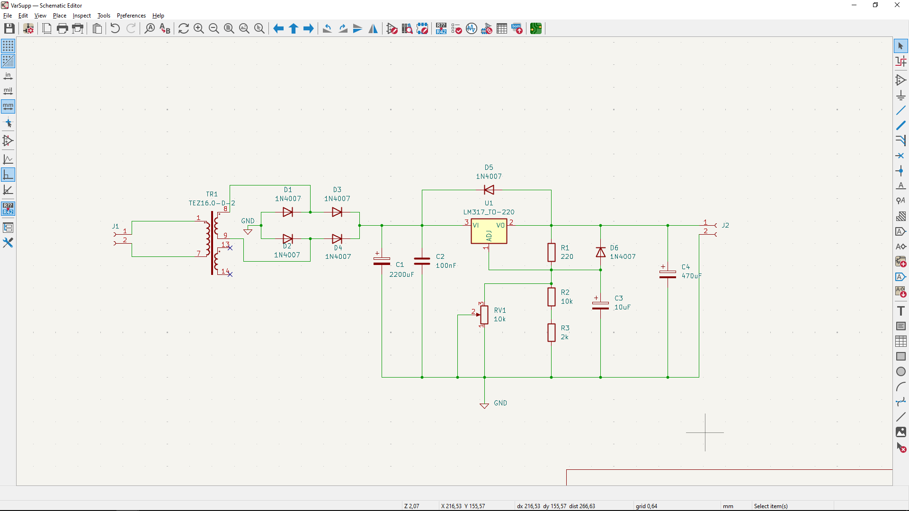

# Variable Power Supply - University Project 

## Overview

This circuit is a project designed for the Fundamental Electronic Circuits laboratory, providing a practical implementation of a variable power supply for testing and experimentation.

# Circuit Scheme

